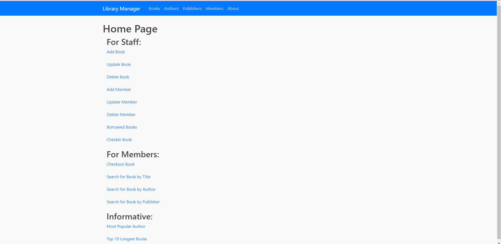
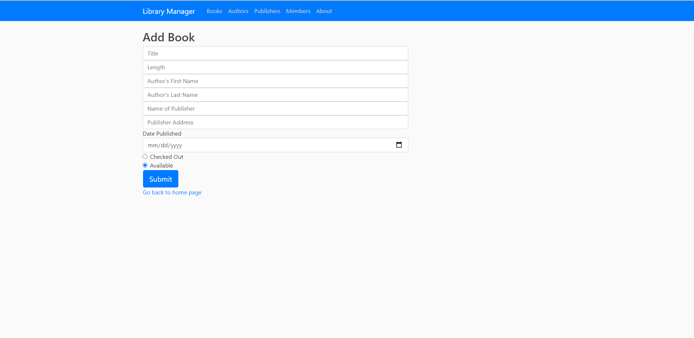
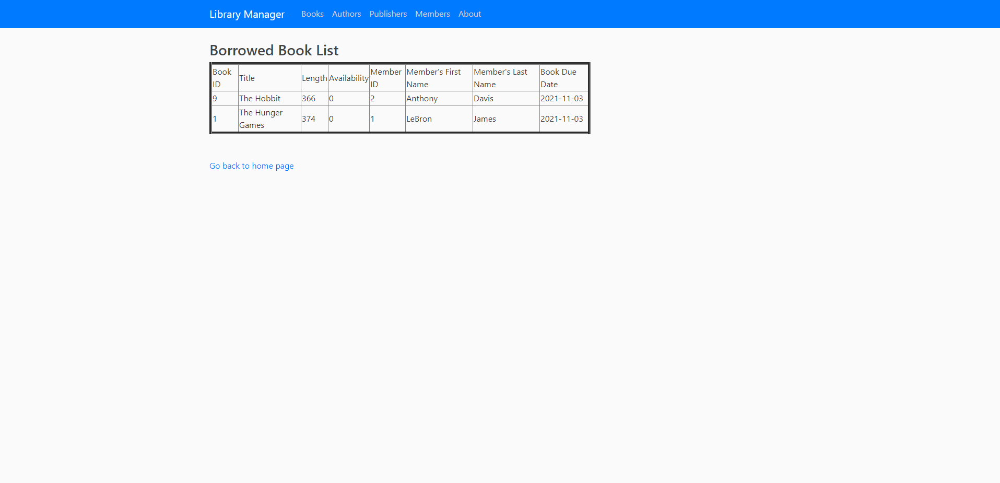
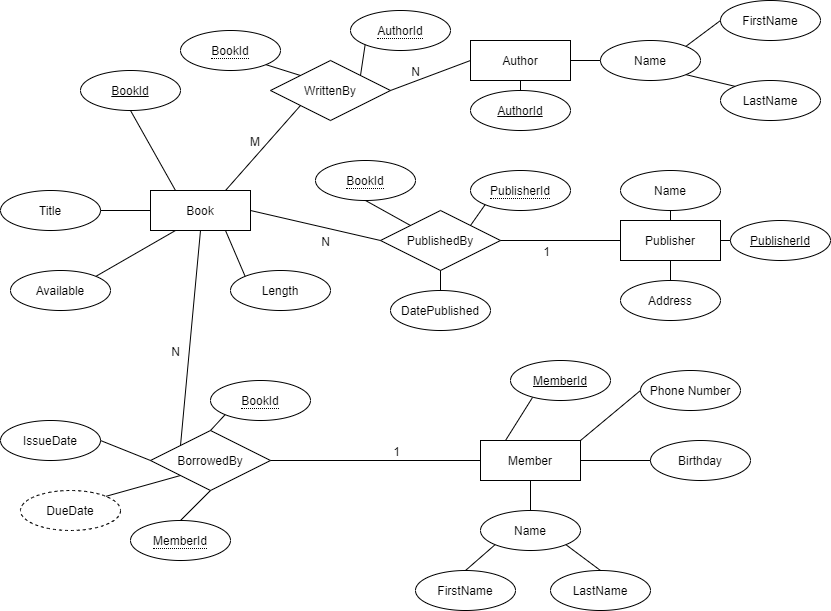

# Library Management Database Project

This project is to demonstrate an understanding of SQL. I designed a website using Python and Flask, 
using SQLite for the database. This program is used to keep track of all of a libraries information.
For example, the books, authors, publishers, and members. Using the website you can interact with all
of the data and can view lists of all the data that is held.

## Images

 The home page 

 Adding a book 

 Viewing the books that are checked out

## ER Diagram

## To Run
To run the program, uncomment the section in routes.py labled "Database creation". Then run python app.py.
After it has been created, comment the section and run the command again to launch the website. The website is located at:
http://127.0.0.1:5000/
